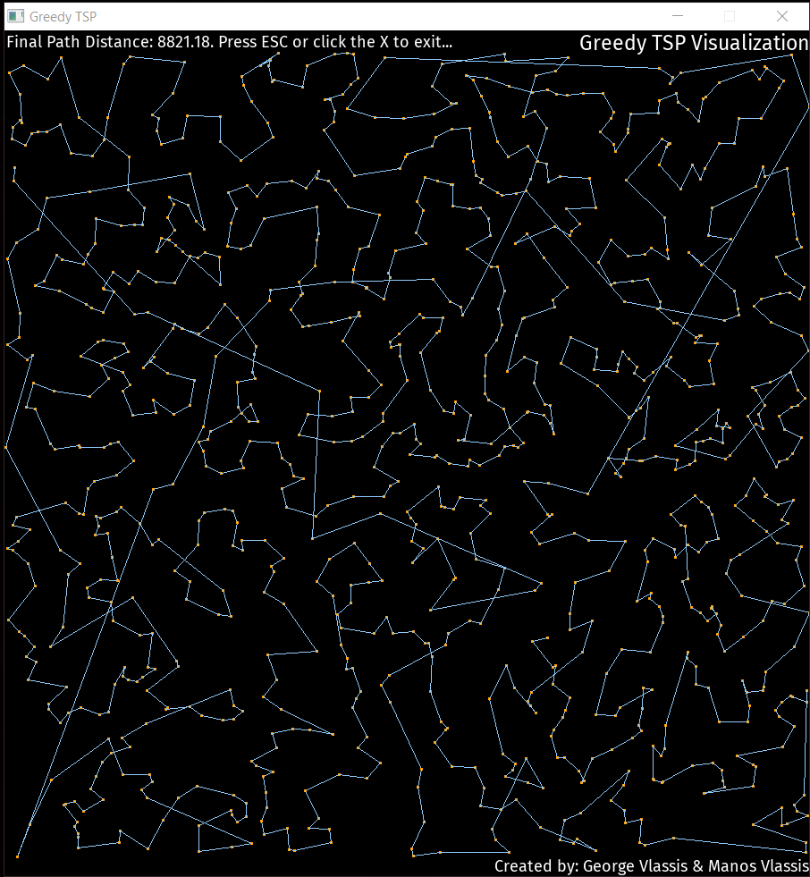
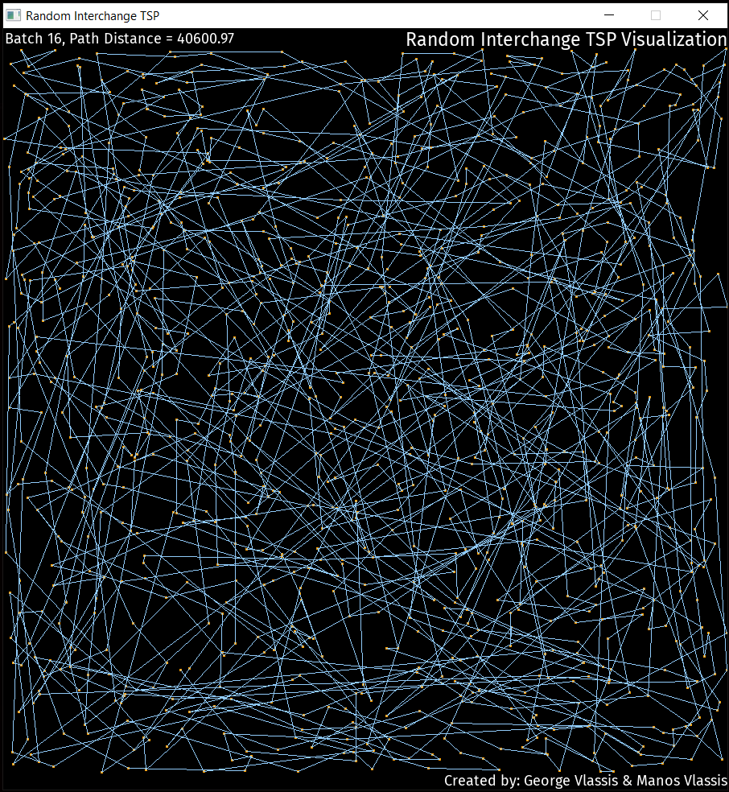

# TSP-Visualizations
 Visualizations of different algorithms trying to solve the [travelling salesman problem](https://en.wikipedia.org/wiki/Travelling_salesman_problem). We have included visualizations for ACO (Ant Colony Optimization), Greedy, and Random Interchange algorithms. 

## Screenshots
  

## Limitations
After running the executable, press ESC or click on the X button to exit. Sometimes the window will take a few seconds to close, especially if the number of cities and/or grid size is large.
If the grid you have chosen during compilation is too large, the window may not fit inside the screen. In this case the X button will not be visible and you will have to press ESC or use the Task Manager to exit.

## Dependencies
The visualization part utilizes the [SDL2](https://www.libsdl.org/) development library.

We also use the [SDL2_tff](https://www.libsdl.org/projects/SDL_ttf/) extension library to render TrueType fonts.

The font we use is [Fira Sans Regular](https://github.com/mozilla/Fira).

## Licenses
The source code is licensed under the [MIT License](https://tldrlegal.com/license/mit-license).
Note that the libraries and fonts in the "dependencies" folder are NOT covered by the MIT license. They are distributed under seperate licenses that can be found in their respective folders.
